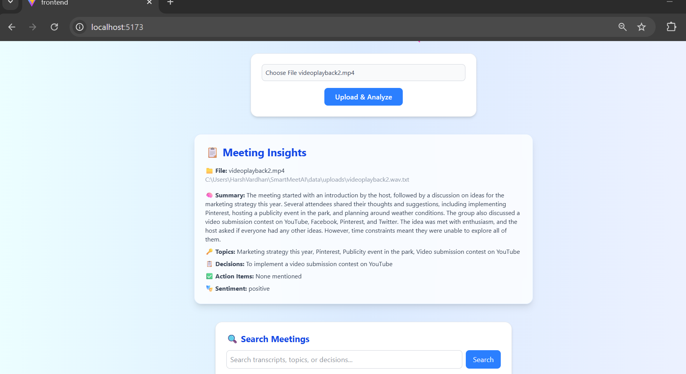
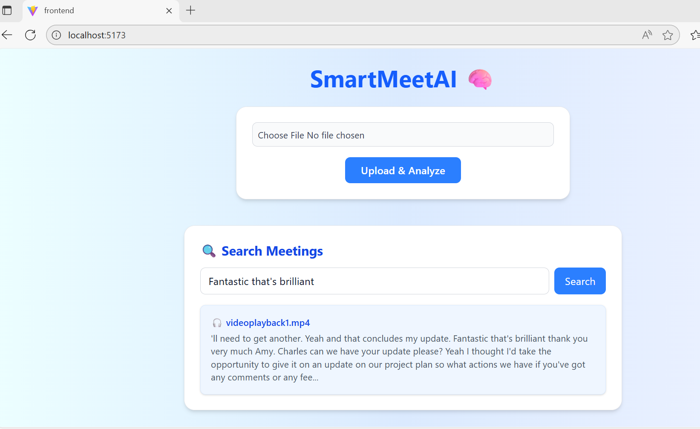

# 🧠 SmartMeetAI

**AI-Powered Meeting Transcription, Summarization & Semantic Search Platform**

SmartMeetAI is an intelligent meeting assistant that automatically transcribes, summarizes, and analyzes audio/video meetings using Whisper, Ollama LLMs, and FAISS vector search. It supports MP3, MP4, and WAV uploads, provides structured summaries, and allows semantic search across past meeting transcripts.

---

## 📸 Demo Screenshots

<div align="center">
  
  <p><em>Main Dashboard - Upload and Manage Meetings</em></p>
  
  
  <p><em>Meeting Analysis - Transcription, Summary & Semantic Search</em></p>
</div>

---

## 🚀 Features

### 🎙️ Audio / Video Ingestion
- Upload `.mp3`, `.wav`, or `.mp4` files via a simple web interface
- Uses FFmpeg for audio extraction and Whisper for high-accuracy transcription

### 🧾 Intelligent Summarization
- Integrates with Ollama (Llama3 or Mistral) for generating:
  - Meeting summaries
  - Key topics
  - Decisions & action items
  - Sentiment insights

### 💬 Semantic Search
- Uses Sentence Transformers + FAISS for embedding and searching transcripts
- Search across all meetings by topics, keywords, or sentences

### 📊 Meeting Management
- Stores transcripts and summaries in a local SQLite database
- Supports retrieving all past meetings and detailed views via REST API

---

## 🏗️ Project Structure

```
SmartMeetAI/
│
├── backend/
│   ├── main.py                # FastAPI backend
│   ├── db.py                  # SQLite DB models and setup
│   ├── search.py              # FAISS + SentenceTransformer search engine
│   ├── services/
│   │   ├── transcriber.py     # Whisper + FFmpeg-based transcription
│   │   ├── summarizer.py      # LLM-based summarization using Ollama
|   ├── whisper
│   ├── data/
│       ├── faiss_index.bin    # FAISS vector index
│       ├── metadata.json      # Metadata for semantic search
│
├── frontend/
│   ├── src/
│   │   ├── App.jsx            # Main React component
│   │   ├── index.css          # Tailwind styles
│   ├── package.json
│   └── vite.config.js
│
├── data 
|   ├── chroma                 # vector database
│   └── uploads                # upload .mp3, .mp4 
├── demo1.png                  # Screenshot 1
├── demo2.png                  # Screenshot 2
├── requirements.txt
└── README.md
```

---

## ⚙️ Setup Instructions

### 🧩 1. Clone the Repository

```bash
git clone https://github.com/harshv2013/SmartMeetAI.git
cd SmartMeetAI
```

### 🐍 2. Setup Python Backend

#### Create virtual environment

```bash
cd backend
python -m venv .venv

# Windows
.venv\Scripts\activate

# macOS/Linux
source .venv/bin/activate
```

#### Install dependencies

```bash
pip install -r requirements.txt
```

**Example `requirements.txt`:**

```txt
fastapi
uvicorn
requests
sentence-transformers
faiss-cpu
numpy
sqlalchemy
pydantic
```

#### Setup FFmpeg and Whisper

- **Download FFmpeg binary** or install using:

```bash
# Windows (using Chocolatey)
choco install ffmpeg

# macOS
brew install ffmpeg

# Linux
sudo apt install ffmpeg
```

Place `ffmpeg.exe` path in environment or use `imageio_ffmpeg` as already integrated.

#### Start the backend

```bash
uvicorn main:app --reload
```

Server runs at 👉 **http://127.0.0.1:8000**

---

### 🤖 3. Setup Ollama (LLM Engine)

1. **Install Ollama** from [ollama.ai](https://ollama.ai)

2. **Pull the model** you want to use:

```bash
ollama pull llama3
```

3. **Start Ollama:**

```bash
ollama serve
```

4. **Verify:**

```bash
curl http://localhost:11434
```

Should return: `Ollama is running`

---

### 🧠 4. Setup Frontend (React + Vite + Tailwind)

```bash
cd ../frontend
npm install
npm run dev
```

Open the frontend at 👉 **http://localhost:5173**

---

## 💡 Usage Flow

1. Launch both **FastAPI** (backend) and **Vite** (frontend)
2. Upload an **MP3 / MP4 / WAV** file
3. Wait while it transcribes and summarizes
4. View:
   - Summary
   - Topics, Decisions, Action Items
   - Sentiment
5. Use the **Search box** to semantically search across all meetings

---

## 🧰 Technologies Used

| Component | Technology |
|-----------|------------|
| **Frontend** | React + Vite + Tailwind CSS |
| **Backend API** | FastAPI |
| **LLM** | Ollama (Llama3 / Mistral) |
| **Transcription** | Whisper (local binary) |
| **Vector Search** | FAISS + Sentence Transformers |
| **Database** | SQLite |
| **Language** | Python, JavaScript |

---

## 📊 Example Output

**Meeting Summary (Auto-generated):**

```json
{
  "summary": "The hosts Feifei and Beth discussed the concept of 'core' used to describe particular styles or vibes...",
  "key_topics": ["Modern slang", "Language trends", "Style"],
  "decisions": [],
  "action_items": ["Review new podcast topics"],
  "sentiment": "neutral"
}
```

---

## 🧪 API Endpoints

| Endpoint | Method | Description |
|----------|--------|-------------|
| `/transcribe/` | POST | Upload and process audio/video |
| `/meetings/` | GET | List all meetings |
| `/meetings/{id}` | GET | Retrieve meeting details |
| `/search?q=` | GET | Semantic search across transcripts |

---

## 🧭 Future Enhancements

- 🎤 **Speaker Diarization** (identify who spoke when)
- 📈 **Analytics Dashboard** (sentiment trends, topic distribution)
- 🗂️ **Cloud Storage Integration** (Azure Blob or S3)
- 💬 **Interactive Chatbot** (query past meetings conversationally)

---

## 🤝 Contributing

Contributions are welcome! Please feel free to submit a Pull Request.

1. Fork the project
2. Create your feature branch (`git checkout -b feature/AmazingFeature`)
3. Commit your changes (`git commit -m 'Add some AmazingFeature'`)
4. Push to the branch (`git push origin feature/AmazingFeature`)
5. Open a Pull Request

---

## 📝 License

This project is licensed under the MIT License - see the [LICENSE](LICENSE) file for details.

---

## 🧑‍💻 Author

**Harsh Vardhan**  
*AI Engineer | Azure | GenAI | Agentic AI*

📧 harsh2013@gmail.com 
🌐 [LinkedIn](https://www.linkedin.com/in/harsh-vardhan-60b6aa106/)  
💻 [GitHub](https://github.com/harshv2013/)

---

## ⭐ Star History

If you find this project useful, please consider giving it a star! ⭐

---

<div align="center">
  Made with ❤️ by Harsh Vardhan
</div>